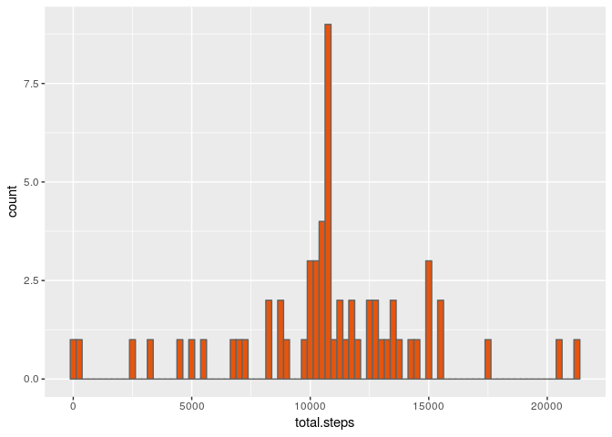

# Reproducible Research: Peer Assessment 1

This document details the steps I took to analize and present the activity data given to us for peer assessment 1 in the Reproducible Research course. First, I loaded and preprocessed the activity data. Next, I found the mean number of total steps per day, made a histogram of the total number of steps per day, and calculated the mean and median of the total number of steps taken per day. After that, I looked into average daily patterns. Then, I imputed missing values and, finally, I looked at whether there was any difference in activity patterns between weekdays and weekends.

## Loading and preprocessing the data

First I'll load the packages I'll need for the analysis.


```r
library(dplyr)
```

```
## 
## Attaching package: 'dplyr'
```

```
## The following objects are masked from 'package:stats':
## 
##     filter, lag
```

```
## The following objects are masked from 'package:base':
## 
##     intersect, setdiff, setequal, union
```

```r
library(ggplot2)
```

Next, I'll load the activity data from the file "activity.csv". Note that this step assumes this document is in the same directory as "activity.csv".


```r
setwd("~/Documents/DataScience/ReproducibleResearch/project1")
data <- read.csv("activity.csv")
summary(data)
```

```
##      steps                date          interval     
##  Min.   :  0.00   2012-10-01:  288   Min.   :   0.0  
##  1st Qu.:  0.00   2012-10-02:  288   1st Qu.: 588.8  
##  Median :  0.00   2012-10-03:  288   Median :1177.5  
##  Mean   : 37.38   2012-10-04:  288   Mean   :1177.5  
##  3rd Qu.: 12.00   2012-10-05:  288   3rd Qu.:1766.2  
##  Max.   :806.00   2012-10-06:  288   Max.   :2355.0  
##  NA's   :2304     (Other)   :15840
```


```r
head(data)
```

```
##   steps       date interval
## 1    NA 2012-10-01        0
## 2    NA 2012-10-01        5
## 3    NA 2012-10-01       10
## 4    NA 2012-10-01       15
## 5    NA 2012-10-01       20
## 6    NA 2012-10-01       25
```

The date column was read as a factor (character data), so I'll translate it into dates using the as.Date() function.


```r
data$date <- as.Date(data$date)
```


## What is mean total number of steps taken per day?

To find the mean total number of steps taken per day, first I'll find the total number of steps for each day (ignoring missing values for now).


```r
totalStepsByDay <- data %>% group_by(date) %>% summarize(total.steps = sum(steps, na.rm = TRUE))
head(totalStepsByDay)
```

```
## # A tibble: 6 × 2
##         date total.steps
##       <date>       <int>
## 1 2012-10-01           0
## 2 2012-10-02         126
## 3 2012-10-03       11352
## 4 2012-10-04       12116
## 5 2012-10-05       13294
## 6 2012-10-06       15420
```

Next, I'll make a histogram of this data. The difference between a bar plot and a histogram is that a histogram shows the distribution of one quantitative variable, whereas a bar plot compares two categorical variables.


```r
totalStepsByDay %>% ggplot(aes(x = total.steps)) + 
  geom_histogram(binwidth = 250, fill = "#2b8cbe", color = "#636363")
```


In my graphs, I like to get the colors from [the color brewer site](https://www.colorbrewer2.org).

For the last part of this section, I'll calculate and report the mean and median of the total number of steps taken per day using the summary function.


```r
summary(totalStepsByDay$total.steps)
```

```
##    Min. 1st Qu.  Median    Mean 3rd Qu.    Max. 
##       0    6778   10400    9354   12810   21190
```

This person had a mean total steps per day of 9,354 and a median total steps per day of 10,400.


## What is the average daily activity pattern?

For this section, I'll go back to the original data set and compute the average number of steps taken in each 5-minute interval, averaged across all days by grouping by interval (instead of date), ignoring missing values.


```r
averageStepsPerInterval <- data %>% group_by(interval) %>% summarize(mean.steps = mean(steps, na.rm = TRUE))
head(averageStepsPerInterval)
```

```
## # A tibble: 6 × 2
##   interval mean.steps
##      <int>      <dbl>
## 1        0  1.7169811
## 2        5  0.3396226
## 3       10  0.1320755
## 4       15  0.1509434
## 5       20  0.0754717
## 6       25  2.0943396
```

Now that I have the averageStepsPerInterval data, I'll make a time series plot of the average by interval.


```r
averageStepsPerInterval %>% ggplot(aes(x = interval, y = mean.steps)) + geom_line(color = "#31a354")
```


From the plot, I can see that the maximum average number of steps occurs near the 800th interval. To find out precisely where it is, I'll select the interval for only the row where mean.steps is the maximum.


```r
averageStepsPerInterval$interval[averageStepsPerInterval$mean.steps == max(averageStepsPerInterval$mean.steps)]
```

```
## [1] 835
```

The intervals start at midnight (interval 0) so interval 835 is in the late morning. Probably this person walks during that time, or maybe jogs or performs some other regular activity.


## Imputing missing values

There are quite a few missing values in the data. First, I'll see how many rows have NA values for each column.


```r
sapply(data, function(x) sum(is.na(x)))
```

```
##    steps     date interval 
##     2304        0        0
```

It looks like all the missing values are in the steps column. There are 2304 out of 17568 of them, or about 13%. There are several ways to deal with missing values. One way is that I could simply delete (or ignore) all the rows with missing values. (In my analysis so far I've been ignoring them.) But 13% of the data is a lot of data to lose. Thus, instead of deleting or ignoring them, I'll try imputing sensible values for the missing data.

I calculated the average steps per interval above. I'll use these values to fill in the missing data. In other words, for each interval where the number of steps is missing, I'll use the mean number of steps for that interval as the value.


```r
# first join on interval so we have the mean values we need
J <- merge(data, averageStepsPerInterval, by = "interval")

# then fill in the steps column with values from the mean.steps column where steps is NA
J <- mutate(J, steps = ifelse(is.na(steps), mean.steps, steps))

# drop unnecessary columns
J <- J[c("steps", "date", "interval")]

# take a look at the result
head(J)
```

```
##      steps       date interval
## 1 1.716981 2012-10-01        0
## 2 0.000000 2012-11-23        0
## 3 0.000000 2012-10-28        0
## 4 0.000000 2012-11-06        0
## 5 0.000000 2012-11-24        0
## 6 0.000000 2012-11-15        0
```

Now I'll see what impact imputing the missing values had on the total number of steps taken each day. First, I'll recompute the totalStepsByDay data.


```r
totalStepsByDay2 <- J %>% group_by(date) %>% summarize(total.steps = sum(steps))
```

Now I'll recalculate the histogram from section one.


```r
totalStepsByDay2 %>% ggplot(aes(x = total.steps)) + 
  geom_histogram(binwidth = 250, fill = "#e6550d", color = "#636363")
```



The distribution of total steps per day has shifted noticeably. There is a much higher peak around 10,800 steps. Also, the high peak at 0 has vanished. I'll use the summary function to see how this has changed the mean and median of the total steps.


```r
summary(totalStepsByDay2$total.steps)
```

```
##    Min. 1st Qu.  Median    Mean 3rd Qu.    Max. 
##      41    9819   10770   10770   12810   21190
```

The median and mean are now the same, which makes sense since I replaced so many values by the mean for those intervals. Also, both values are higher. The median is higher by a small amount, the mean is higher by an appreciable amount. Although these values differ from the version of the data with missing values, this imputed data is probably more representative of the person's habits.


## Are there differences in activity patterns between weekdays and weekends?

In the final section, I'll look at whether weekdays are different than weekends in terms of activity. First, I'll create a new column, a factor variable called "day" indicating what day of the week it is. Then I'll use that column to create a factor variable called "day.type" that has either the value "weekend" for a weekend day or "weekday" for a weekday.


```r
J$day <- weekdays(J$date)
J <- mutate(J, day.type = ifelse((day == "Sunday") | (day == "Saturday"), "weekend", "weekday"))
J$day.type <- factor(J$day.type)
```

Now I'll make a multiplot of the 5-minute interval versus the average number of steps taken for both weekends and weekdays. First, I'll calculate the average number of steps for the two categories.


```r
avgNumSteps2 <- J %>% group_by(day.type, interval) %>% summarize(avg.steps = mean(steps))
```


Then, I'll plot the result.


```r
ggplot(avgNumSteps2, aes(x = interval, y = avg.steps)) + 
  geom_line(color = "#756bb1") +
  facet_grid(day.type ~ .)
```


There do appear to be different patterns in these graphs. In both graphs, the highest peaks occur in the mornings. However, during the weekdays, the morning peak is higher. During the weekend it seems overall activity is greater throughout the day, even though the highest peak is lower.


